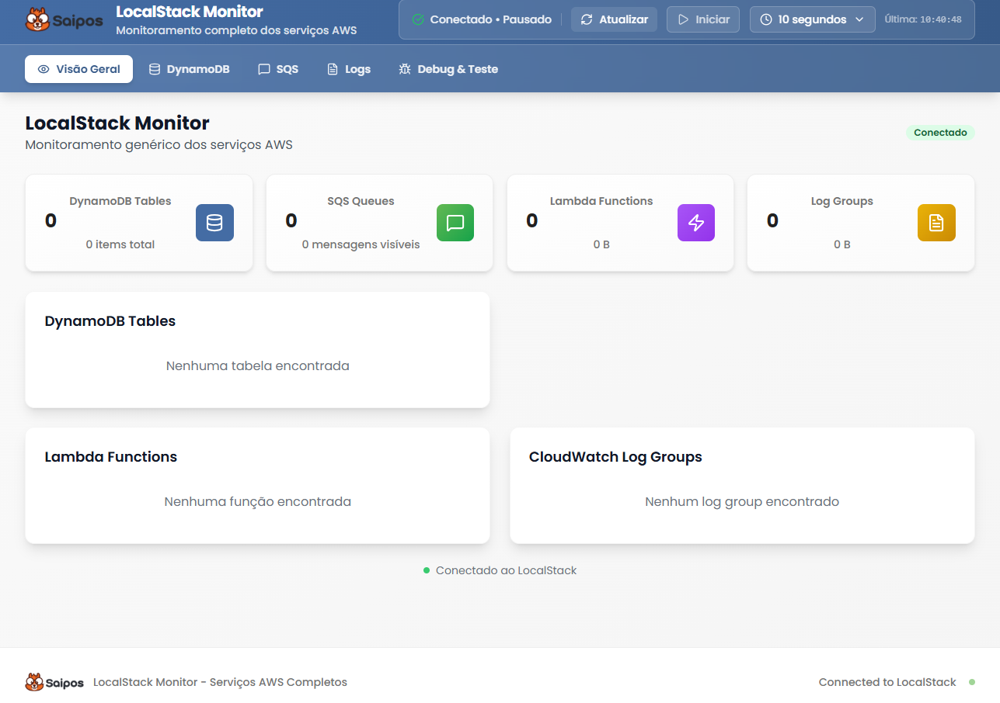

# 📊 LocalStack Analytics Dashboard

Um dashboard moderno e intuitivo para monitoramento e gerenciamento de serviços AWS via LocalStack, desenvolvido especificamente para o ecossistema Saipos.



## 🚀 Características Principais

### 📈 **Monitoramento em Tempo Real**
- Métricas de tokens DynamoDB com atualização automática
- Status de filas SQS com contadores de mensagens
- Distribuição de dados por plataforma
- Logs de execução Lambda em tempo real

### 🔄 **Conexão Inteligente**
- Sistema de fallback com 2 camadas: AWS SDK → API Direta
- Proxy inteligente para resolver problemas de CORS
- Indicadores visuais de status de conexão
- Teste de conectividade integrado

### 🎯 **Interface Moderna**
- Design responsivo com Tailwind CSS
- Componentes reutilizáveis e modulares
- Navegação por abas intuitiva
- Tratamento de erros robusto com Error Boundaries

## 🛠️ Tecnologias Utilizadas

- **Frontend**: React 19 + TypeScript + Vite
- **Styling**: Tailwind CSS + PostCSS
- **AWS Integration**: AWS SDK v3 + LocalStack
- **Charts**: Recharts para visualizações
- **Icons**: Lucide React
- **Build**: Vite com Hot Module Replacement

## 📦 Instalação e Configuração

### Pré-requisitos
- Node.js 18+
- npm ou yarn
- LocalStack rodando na porta 4566

### 1. Instalação das Dependências
```bash
# Clone o repositório
git clone <repository-url>
cd saipos-localstack-monitor

# Instale as dependências
npm install
```

### 2. Configuração do Ambiente

O projeto está configurado para conectar automaticamente com:
- **LocalStack**: `http://localhost:4566`
- **API Server**: `http://localhost:3006`
- **Frontend**: `http://localhost:3005`

### 3. Execução

```bash
# Desenvolvimento (frontend + API server)
npm run dev

# Apenas frontend
npm run frontend

# Apenas API server
npm run api

# Build para produção
npm run build
```

## 🌐 Acesso ao Sistema

Após iniciar o projeto:
- **Dashboard**: `http://localhost:3005`
- **API Health**: `http://localhost:3006/health`

## 📊 Funcionalidades Detalhadas

### 🏠 **Dashboard Principal (Overview)**
- Métricas consolidadas de todos os serviços
- Cards interativos com navegação rápida
- Gráficos de distribuição e tendências
- Status de conexão em tempo real

### 🗄️ **DynamoDB Manager (Tokens)**
- Visualização de tabelas
- CRUD completo de itens
- Editor JSON integrado
- Busca e filtros avançados

### 📬 **SQS Monitor (Queue)** 
- Monitor da filas
- Envio e visualização de mensagens
- Purge de filas
- Monitoramento de dead letter queues

### ⚡ **Lambda Viewer**
- Lista de funções com detalhes
- Métricas de execução
- Visualização de logs em tempo real
- Filtros por período e nível

### 📝 **Logs Viewer**
- Logs do CloudWatch
- Filtro por função e timestamp
- Busca textual nos logs
- Export de logs

### 🐛 **Debug Panel**
- Testes de conectividade
- Diagnósticos de serviços
- Informações de troubleshooting
- Health checks automatizados

## 🔧 Arquitetura do Sistema

### Frontend (React)
```
src/
├── components/           # Componentes React organizados
│   ├── dashboard/       # Componentes específicos do dashboard
│   ├── layout/          # Componentes de layout (Header, etc.)
│   └── shared/          # Componentes reutilizáveis
├── hooks/               # Custom hooks
├── services/            # Serviços de API
├── types/               # Definições TypeScript
└── utils/               # Utilitários e helpers
```

### Backend Proxy (Node.js/Express)
- Servidor Express na porta 3006
- Proxy reverso para LocalStack
- Tratamento de CORS
- Health checks e diagnósticos

### Sistema de Fallback
1. **AWS SDK**: Conexão preferencial com LocalStack
2. **API Direta**: Fallback via HTTP direto
3. **Mock Data**: Dados de demonstração

## 🚦 Status de Conexão

O sistema exibe diferentes estados visuais:

- 🟢 **Verde (Conectado)**: LocalStack acessível, dados reais
- 🟡 **Amarelo (Mock)**: LocalStack indisponível, dados de demonstração
- 🔴 **Vermelho (Erro)**: Problemas de conectividade

### Teste de Conectividade
1. Acesse a aba **"Debug"**
2. Clique em **"Test Connections"**  
3. Visualize o status detalhado de cada serviço

## 🔄 Auto-refresh e Performance

- **Intervalo padrão**: 10 segundos
- **Refresh global**: Todos os componentes sincronizados
- **Refresh seletivo**: Apenas dados visíveis são atualizados
- **Pause automático**: Quando aba não está ativa

## 🤝 Contribuição

### Estrutura de Commits
- `feat:` Nova funcionalidade
- `fix:` Correção de bug
- `docs:` Documentação
- `style:` Formatação
- `refactor:` Refatoração
- `test:` Testes

### Desenvolvimento Local
```bash
# Branch para nova feature
git checkout -b feat/nova-funcionalidade

# Commit com padrão
git commit -m "feat: adiciona visualização de métricas Lambda"

# Push e Pull Request
git push origin feat/nova-funcionalidade
```

## 📄 Scripts Disponíveis

```bash
npm run dev       # Frontend + API server em paralelo
npm run frontend  # Apenas Vite dev server (porta 3005)
npm run api       # Apenas API proxy server (porta 3006)
npm run build     # Build para produção
npm run preview   # Preview do build de produção
npm run lint      # ESLint para análise de código
```

## 🆘 Suporte e Troubleshooting

### Problemas Comuns

1. **"Failed to fetch"**
   - ✅ Resolvido com proxy Vite
   - Fallback automático ativo

2. **LocalStack não conecta**
   - Verifique se está rodando na porta 4566
   - Use `docker ps` para confirmar

3. **Dados não atualizam**
   - Verifique conexão de rede
   - Sistema entra automaticamente em modo mock

4. **Porta 3005 ocupada**
   - Modifique no `package.json` script `frontend`
   - Ou use `--port <numero>` no comando

### Logs de Debug
- Browser DevTools → Console
- Network tab para requisições
- API server logs no terminal

### Status do Sistema
- **Funcional**: ✅ Dashboard operacional
- **Conectividade**: ✅ Fallbacks funcionando
- **Interface**: ✅ Responsiva e moderna
- **Performance**: ✅ Auto-refresh otimizado

---

**Desenvolvido para o ecossistema Saipos**
